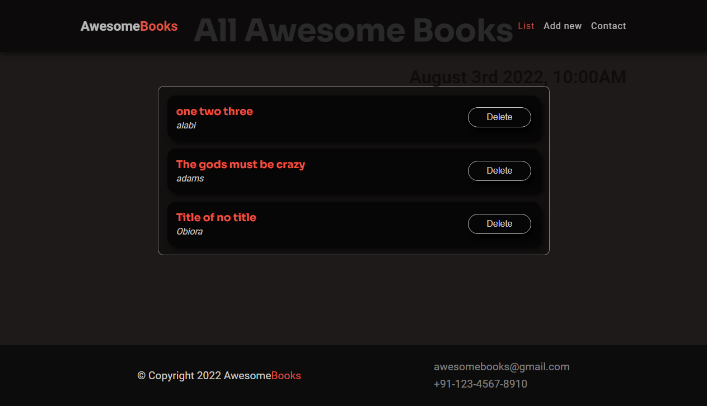
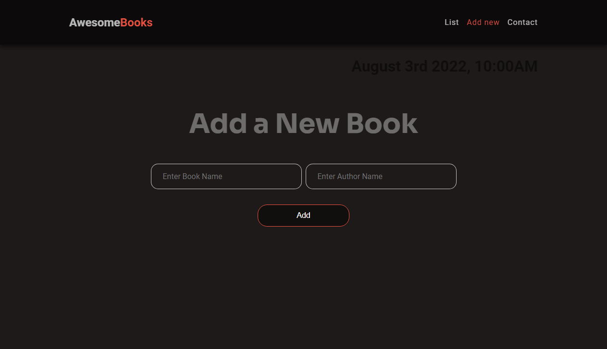

# awesome-books

> This project is to build a book library, that has functionality to Creates, Update and Delete (CRUD) books. Local storage was used in other to preserve user activities on this page

## Built With

- HTML
- CSS
- Javascript

## To get a local copy up and running follow these simple example steps.

- Clone this repo to your machine by using Git clone: Git clone https://github.com/DuaneDave/Awesome-Books.git
- open in your vs code terminal and run live server

### Run the following tests:

- `npx hint .`
- `npx stylelint "\*_/_.{css,scss}"`
- `npx eslint .`

### LIVE DEMO

Check the live demo here [LINK](https://duanedave.github.io/Awesome-Books/)

## Authors

👤 **Obiebi Okiemute David**

- GitHub: [@githubhandle](https://github.com/DuaneDave)
- Twitter: [@twitterhandle](https://twitter.com/dave_duane)
- LinkedIn: [LinkedIn](https://www.linkedin.com/in/okiemute-david-obiebi-6b4a6a230/)

👤 **Festus Enning**

- GitHub: [@githubhandle](https://github.com/Enning94)
- Twitter: [@twitterhandle](https://twitter.com/nana_akyerefi)
- LinkedIn: [LinkedIn](https://linkedin.com/in/enning-festus)

## 🤝 Contributing

Contributions, issues, and feature requests are welcome!

Feel free to check the [issues page](https://github.com/DuaneDave/Awesome-Books/issues).

## Show your support

Give a ⭐️ if you like this project!

## Acknowledgments

- Hat tip to anyone whose code was used
- Inspiration
- etc

## 📝 License

This project is not licensed.
